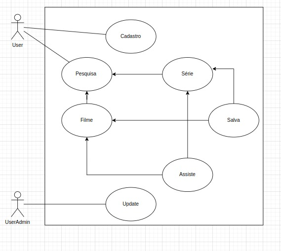
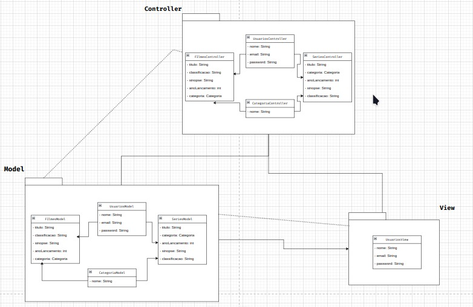

# MJVer

 <div>
     
     
  <div/>

Aplicação desenvolvida na MJV School de Java para avaliação do que foi aprendido no curso.


## Instalação

Instale MJVer com clonando o repositório

```bash
  git clone https://github.com/viccttor/group-mjv-school.git
```


## Funcionalidades

- Cadastro de usuários/filmes/séries/categorias
- Login do usuário
- Acesso acervo de filmes/séries


## Screenshots

- [Caso de uso](https://drive.google.com/file/d/1dmGTrkD596eeozXSV1_BNwkSERJUF7bh/view?usp=sharing)




- [Estrtura da aplicação](https://drive.google.com/file/d/1R05lyJ8fD_efIApEuW9z1KCLOuqgTlED/view?usp=sharing)




## Uso/Exemplos

```
a ser preenchido
```

### Stack utilizada:
  * [JAVA 11](https://www.azul.com/downloads/)  
  * [SPRING-BOOT](https://start.spring.io/)
  * [MAVEN]( https://mvnrepository.com/)
  * [H2 DATABASE]( https://www.h2database.com/html/main.html)
  * [MYSQL ](  https://www.mysql.com/downloads/)
  
### Autores:
- [Deysi Lopes](https://github.com/DeysiLopes)
- [Diego Cardoso](https://github.com/DiegoCardosoDev))


## Aprendizados

O que você aprendeu construindo esse projeto? Quais desafios você enfrentou e como você superou-os?


## Licença

[MIT](https://choosealicense.com/licenses/mit/)

